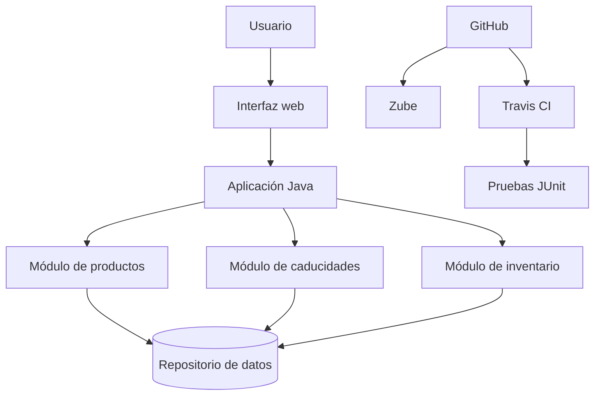

# Arquitectura de la solución

```mermaid
flowchart TD
    U[Usuario] --> W[Interfaz web]
    W --> A[Aplicación Java]
    A --> P[Módulo de productos]
    A --> C[Módulo de caducidades]
    A --> I[Módulo de inventario]
    P --> D[(Repositorio de datos)]
    C --> D
    I --> D

    G[GitHub] --> Z[Zube]
    G --> T[Travis CI]
    T --> J[Pruebas JUnit]
```
