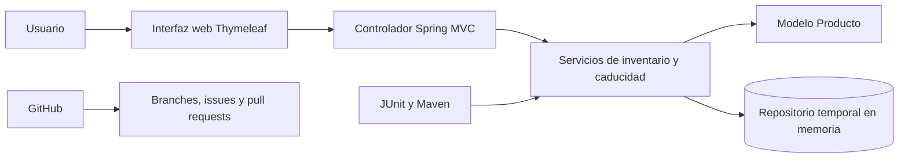

# Sistema web de inventario y fechas de caducidad

Sistema académico desarrollado para administrar productos de una tienda local,
separar existencias en piso y bodega y clasificar las fechas de caducidad con
un semáforo visual.

## Tabla de contenidos

1. [Resumen ejecutivo](#resumen-ejecutivo)
2. [Problema identificado](#problema-identificado)
3. [Solución propuesta](#solución-propuesta)
4. [Arquitectura](#arquitectura)
5. [Requerimientos](#requerimientos)
6. [Instalación](#instalación)
7. [Configuración](#configuración)
8. [Ejecución de pruebas](#ejecución-de-pruebas)
9. [Implementación local](#implementación-local)
10. [Uso para usuario final](#uso-para-usuario-final)
11. [Uso para administrador](#uso-para-administrador)
12. [Contribución](#contribución)
13. [Roadmap](#roadmap)
14. [Documentación complementaria](#documentación-complementaria)

## Resumen ejecutivo

El producto permite registrar artículos, cantidades en piso, cantidades en
bodega y fechas de caducidad. La aplicación calcula automáticamente el estado
de cada producto:

- **ROJO:** producto caducado.
- **AMARILLO:** producto que caduca hoy o dentro de siete días.
- **VERDE:** producto con más de siete días de vigencia.

La solución se distribuye como un JAR ejecutable y utiliza Spring Boot con un
servidor web Tomcat embebido.

## Problema identificado

El control manual de inventarios y caducidades puede provocar conteos
incompletos, retiro tardío de productos, pérdidas económicas y dificultad para
distinguir existencias en piso y bodega.

## Solución propuesta

Se desarrolló una aplicación web que centraliza la captura y consulta del
inventario. El sistema ofrece:

- Registro de productos.
- Cantidad en piso, bodega y total.
- Semáforo automático de caducidades.
- Resumen de productos caducados, próximos y vigentes.
- Eliminación administrativa de registros.
- Validación de campos y cantidades.
- Pruebas unitarias con JUnit 5.

## Arquitectura



### Componentes

- **Cliente web:** navegador moderno.
- **Servidor web y de aplicación:** Tomcat embebido en Spring Boot.
- **Lógica:** Java 17, Spring MVC y servicios.
- **Presentación:** HTML, CSS y Thymeleaf.
- **Datos:** almacenamiento temporal en memoria para la versión académica.
- **Construcción:** Maven.
- **Pruebas:** JUnit 5 y Spring Boot Test.

## Requerimientos

### Software

- Java Development Kit 17.
- Apache Maven 3.6.3 o superior.
- Git.
- Navegador Chrome, Edge o Firefox.
- Puerto local 8080 disponible.

### Paquetes principales

- Spring Boot Web.
- Thymeleaf.
- Bean Validation.
- Spring Boot Test.
- JUnit 5.

### Servidores y base de datos

No es necesario instalar un servidor externo: el JAR contiene Tomcat
embebido. La versión 1.0.0 usa almacenamiento en memoria y no requiere base de
datos. La persistencia mediante MySQL o PostgreSQL forma parte del roadmap.

## Instalación

### 1. Clonar el repositorio

```bash
git clone https://github.com/ZAV000/inventario-tienda-local.git
cd inventario-tienda-local
```

### 2. Cambiar a la rama de desarrollo

```bash
git checkout develop
git pull origin develop
```

### 3. Compilar el proyecto

```bash
mvn clean package
```

El archivo resultante se genera en:

```text
target/inventario-tienda-local-1.0.0.jar
```

### 4. Ejecutar en desarrollo

```bash
mvn spring-boot:run
```

Abrir en el navegador:

```text
http://localhost:8080
```

## Configuración

La configuración principal está en:

```text
src/main/resources/application.properties
```

Propiedades disponibles:

```properties
spring.application.name=inventario-tienda-local
server.port=${PORT:8080}
spring.thymeleaf.cache=false
```

Para usar otro puerto:

**Windows PowerShell**

```powershell
$env:PORT=9090
java -jar target/inventario-tienda-local-1.0.0.jar
```

**Linux o macOS**

```bash
PORT=9090 java -jar target/inventario-tienda-local-1.0.0.jar
```

## Ejecución de pruebas

Ejecutar todas las pruebas:

```bash
mvn clean test
```

Ejecutar solamente las pruebas de caducidad:

```bash
mvn -Dtest=ServicioCaducidadTest test
```

Los resultados se almacenan en:

```text
target/surefire-reports/
```

## Implementación local

### JAR ejecutable

```bash
mvn clean package
java -jar target/inventario-tienda-local-1.0.0.jar
```

También puede ejecutarse `run.bat` en Windows después de generar el JAR.

### Contenedor Docker opcional

```bash
mvn clean package
docker build -t inventario-tienda-local:1.0.0 .
docker run --rm -p 8080:8080 inventario-tienda-local:1.0.0
```

## Uso para usuario final

1. Abrir `http://localhost:8080`.
2. Escribir el nombre del producto.
3. Capturar cantidad en piso y bodega.
4. Elegir la fecha de caducidad.
5. Presionar **Guardar producto**.
6. Consultar la tabla y el estado de color correspondiente.

El resumen superior muestra productos registrados, unidades totales y
cantidades por estado.

## Uso para administrador

En la versión académica no existe autenticación. Las tareas administrativas
se realizan desde la pantalla principal:

- Revisar cantidades.
- Identificar artículos caducados.
- Retirar un registro mediante **Eliminar**.
- Cambiar el puerto desde `application.properties` o la variable `PORT`.
- Crear el JAR con `mvn clean package`.
- Revisar reportes de pruebas en `target/surefire-reports`.

## Contribución

### Flujo obligatorio

1. Clonar el repositorio:

   ```bash
   git clone https://github.com/ZAV000/inventario-tienda-local.git
   ```

2. Actualizar `develop`:

   ```bash
   git checkout develop
   git pull origin develop
   ```

3. Crear un branch único:

   ```bash
   git checkout -b feature/nombre-de-la-funcionalidad
   ```

4. Realizar cambios y pruebas:

   ```bash
   mvn clean test
   ```

5. Crear el commit:

   ```bash
   git add .
   git commit -m "feat: describir el cambio realizado"
   ```

6. Enviar el branch:

   ```bash
   git push -u origin feature/nombre-de-la-funcionalidad
   ```

7. Abrir un pull request con `develop` como rama base.
8. Esperar la revisión y la autorización del merge.
9. Integrar `develop` a `master` únicamente cuando la versión sea estable.

No deben enviarse cambios directamente a `master`.

## Roadmap

- Persistencia con MySQL o PostgreSQL.
- Edición de productos.
- Fotografías de artículos.
- Lectura de códigos de barras.
- Reportes CSV y PDF.
- Autenticación y roles.
- Alertas por correo.
- Despliegue en la nube.
- Historial de movimientos.
- Control de lotes y múltiples fechas por producto.

## Documentación complementaria

- [Manual de usuario](docs/MANUAL_USUARIO.md)
- [Manual de administrador](docs/MANUAL_ADMINISTRADOR.md)
- [Guía de contribución](CONTRIBUTING.md)
- [Guion del video](docs/GUIA_VIDEO.md)

## Licencia y uso

Proyecto académico elaborado para Universidad Tecmilenio.
